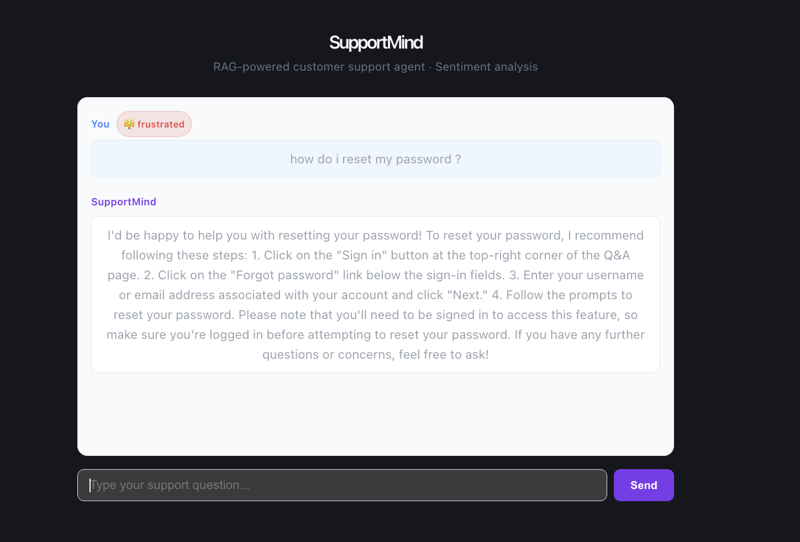

# SupportMind — RAG-Powered Customer Support System


---

**SupportMind** is a full-stack, production-style customer support system that combines Retrieval-Augmented Generation (RAG), sentiment analysis, caching, and observability to deliver accurate, low-latency responses at scale.

This project demonstrates real-world system design by integrating LLM inference, vector search, performance optimization, and monitoring into a single scalable architecture.

---

## Architecture Overview

```
User → React Frontend → FastAPI Backend
                         │
                         ├── RAG Pipeline (LangChain + ChromaDB)
                         │       ├── Embeddings
                         │       ├── Vector Retrieval
                         │       └── LLM (Ollama)
                         │
                         ├── Sentiment Analysis (OpenAI API)
                         │
                         ├── LRU Cache (low-latency optimization)
                         │
                         └── Prometheus Metrics (/metrics endpoint)
```

---

## Demo



---

## Tech Stack

### Backend
- FastAPI
- LangChain (RAG pipeline)
- ChromaDB (vector database)
- Ollama (local LLM inference)
- OpenAI API (sentiment classification)
- Prometheus (metrics + observability)

### Frontend
- React + TypeScript (Vite)
- Axios

### Infra / Tools
- wrk (load testing)
- AWS EC2 (deployment)

---

## Key Features

- RAG Pipeline using LangChain and ChromaDB for context-aware responses  
- Sentiment Analysis with structured classification (positive, neutral, frustrated)  
- Low-latency caching layer reducing repeated queries by ~99.9%  
- Responsible AI design with source grounding (removable in UI)  
- Prometheus observability for request volume, latency, and cache efficiency  
- Fault-tolerant backend with retry logic and error handling  

---

## Performance

- p95 latency (uncached): ~7–10 seconds  
- Cached latency: ~30 milliseconds  
- Latency reduction: ~99.9%  
- Load tested using `wrk` with concurrent requests  
- Cache efficiency tracked via Prometheus (hits vs misses)

---

## Load Testing

Install wrk:

```bash
brew install wrk
```

Run test:

```bash
wrk -t4 -c10 -d30s -s post.lua http://localhost:8000/chat
```

Create `post.lua`:

```lua
wrk.method = "POST"
wrk.body = '{"message": "How do I reset my password?"}'
wrk.headers["Content-Type"] = "application/json"
```

---

## Observability (Prometheus)

Access metrics:

```bash
curl http://localhost:8000/metrics
```

Tracked metrics:

- `supportmind_requests_total`
- `supportmind_latency_seconds`
- `supportmind_sentiment_total`
- `supportmind_cache_hits_total`
- `supportmind_cache_misses_total`

---

## Local Setup

### Backend

```bash
cd backend
python -m venv venv
source venv/bin/activate
pip install -r requirements.txt

uvicorn main:app --reload --port 8000
```

---

### Frontend

```bash
cd frontend
npm install
npm run dev
```

Frontend runs at:

```
http://localhost:5173
```

---

## Ollama Setup (Local LLM)

```bash
ollama pull llama3
ollama run llama3
```

Ensure Ollama is running before starting backend.

---

## AWS Deployment (EC2)

1. Launch EC2 instance (Ubuntu / Amazon Linux)

2. Install dependencies:

```bash
sudo apt update
sudo apt install python3-pip nodejs npm git -y
```

3. Clone repository:

```bash
git clone <your-repo-url>
cd supportmind
```

4. Start backend:

```bash
cd backend
pip install -r requirements.txt
uvicorn main:app --host 0.0.0.0 --port 8000
```

5. Open port **8000** in EC2 security group

---

## Why This Project Stands Out

This system demonstrates production-grade engineering:

- End-to-end RAG system design  
- Latency optimization through caching  
- Observability using Prometheus metrics  
- Load testing and performance benchmarking  
- Fault tolerance with retry mechanisms  
- Full-stack integration (React + FastAPI + LLMs)

---

## Future Improvements

- Redis distributed caching  
- Streaming responses (WebSockets)  
- Multi-turn conversational memory  
- Kubernetes deployment  
- GPU acceleration for LLM inference  

---

## Author

**Rudra Brahmbhatt**  
MS Computer Science — Texas State University  

---

## Final Note

SupportMind is designed to showcase **system-level thinking**, combining backend engineering, machine learning, and performance optimization into a scalable, real-world application.
