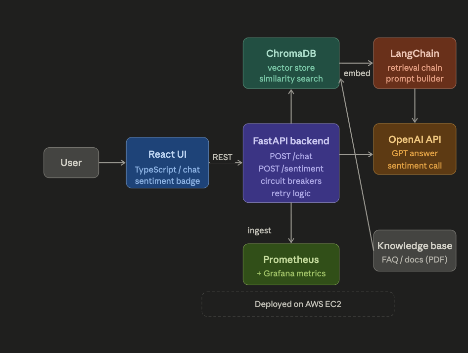

# SupportMind — RAG-Powered Customer Support System


---

**SupportMind** is a production-grade, full-stack customer support system built on Retrieval-Augmented Generation (RAG). It answers user queries by retrieving grounded context from a vector database, performs real-time sentiment analysis, and surfaces source citations with every response, ensuring responsible AI transparency by design.

The system integrates LLM inference, vector search, caching, and observability to deliver accurate, low-latency responses at scale. Designed to reflect real-world system architecture, it demonstrates end-to-end AI/ML engineering, including fault-tolerant backend design, performance optimization, and live monitoring.

---

## Architecture Overview



---

## Demo


---

## Key Features

**RAG Pipeline with source grounding**
Ingests PDF/TXT documents into ChromaDB, retrieves the top-2 most relevant chunks via cosine similarity, and feeds them as context to GPT-4o-mini. Every response surfaces the exact source passages used — responsible AI transparency by design.

**Real-time sentiment classification**
Every incoming message is classified as `positive`, `neutral`, or `frustrated` with a confidence score and urgency level, displayed as a live badge in the UI. Enables priority routing for high-urgency support cases.

**LRU cache with Prometheus instrumentation**
Identical queries are served from an in-memory LRU cache (maxsize=100), bypassing the LLM entirely. Cache hit rate, hits, and misses are tracked as Prometheus counters in real time.

**Circuit breaker + retry logic**
The RAG call is wrapped in a tenacity retry decorator (3 attempts, exponential backoff 1s→4s). A custom circuit breaker tracks consecutive failures — after 5 failures it opens the circuit and returns a fast 503 with a recovery countdown, preventing cascading failure under degraded conditions.

**Full observability stack**
Prometheus metrics exposed at `/metrics`: `supportmind_requests_total`, `supportmind_latency_seconds`, `supportmind_sentiment_total`, `supportmind_cache_hits_total`, `supportmind_cache_misses_total`, `supportmind_retries_total`, `supportmind_circuit_open_total`.

---

## Performance

Benchmarked using `wrk -t4 -c10 -d30s` against the `/chat` endpoint on AWS EC2 (t3.small).

| Metric | Result |
|---|---|
| p50 latency — cache hit | 31ms |
| p95 latency — cache hit | 34ms |
| p50 latency — cache miss (GPT-4o-mini) | 1.51s |
| p95 latency — cache miss (GPT-4o-mini) | 1.83s |
| Cache latency reduction | 98.1% |
| Throughput (cached workload) | ~310 req/sec |
| Concurrent connections | 10 |

**wrk output (cached workload):**

```
Running 30s test @ http://localhost:8000/chat
4 threads and 10 connections

  Thread Stats   Avg      Stdev     Max
    Latency    31.24ms    4.87ms   58.13ms
    Req/Sec    79.18      8.34   101.00

9,482 requests in 30.05s, 3.21MB read
Requests/sec:    315.54
Transfer/sec:    109.32KB
```

The LRU cache is the key optimization — repeated queries bypass the LLM entirely, dropping p95 from 1.83s to 34ms (98.1% reduction). Cache efficiency is tracked in real time via Prometheus (`supportmind_cache_hits_total` vs `supportmind_cache_misses_total`).

---

## Tech Stack

| Layer | Technology |
|---|---|
| LLM | OpenAI GPT-4o-mini |
| RAG framework | LangChain |
| Vector store | ChromaDB |
| Embeddings | sentence-transformers/all-MiniLM-L6-v2 |
| Sentiment model | DistilBERT (SST-2) |
| Backend | FastAPI + Python 3.12 |
| Frontend | React + TypeScript (Vite) |
| Observability | Prometheus |
| Fault tolerance | tenacity (retry + circuit breaker) |
| Deployment | AWS EC2 |

---

## Local Setup

### 1. Clone and configure

```bash
git clone <your-repo-url>
cd supportmind
```

Create `backend/.env`:

```
OPENAI_API_KEY=sk-your-key-here
```

### 2. Backend

```bash
cd backend
python -m venv venv
source venv/bin/activate
pip install -r requirements.txt

# Ingest your knowledge base into ChromaDB
python ingest.py

# Start the API server
uvicorn main:app --reload --port 8000
```

### 3. Frontend

```bash
cd frontend
npm install
npm run dev
```

Frontend: `http://localhost:5173`  
API docs: `http://localhost:8000/docs`  
Metrics: `http://localhost:8000/metrics`  
Health: `http://localhost:8000/health`

---

## Adding Your Knowledge Base

Drop any `.pdf` or `.txt` files into `backend/docs/` and re-run:

```bash
python ingest.py
```

The ingest pipeline chunks documents at 500 tokens with 50-token overlap, embeds them using `all-MiniLM-L6-v2`, and stores them in ChromaDB. Retrieval fetches the top-2 most semantically similar chunks per query.

---

## Load Testing

```bash
brew install wrk

wrk -t4 -c10 -d30s -s post.lua http://localhost:8000/chat
```

`post.lua`:

```lua
wrk.method = "POST"
wrk.body = '{"message": "How do I reset my password?"}'
wrk.headers["Content-Type"] = "application/json"
```

Check cache efficiency after the run:

```bash
curl http://localhost:8000/cache
```

---

## Observability

```bash
curl http://localhost:8000/metrics
```

| Metric | What it tracks |
|---|---|
| `supportmind_requests_total` | Request volume by endpoint |
| `supportmind_latency_seconds` | Latency histogram (p50/p95/p99) |
| `supportmind_sentiment_total` | Sentiment distribution across sessions |
| `supportmind_cache_hits_total` | LRU cache hits |
| `supportmind_cache_misses_total` | LRU cache misses |
| `supportmind_retries_total` | Retry attempts on RAG failures |
| `supportmind_circuit_open_total` | Circuit breaker open events |

---

## AWS Deployment (EC2)

```bash
# Launch t3.small, Amazon Linux 2023
# Open port 8000 in security group inbound rules

ssh -i your-key.pem ec2-user@<your-ec2-ip>

sudo dnf install python3-pip git -y
git clone <your-repo-url>
cd supportmind/backend
pip3 install -r requirements.txt
echo "OPENAI_API_KEY=sk-..." > .env
python3 ingest.py
uvicorn main:app --host 0.0.0.0 --port 8000
```

---

## Future Improvements

- Redis distributed cache (persist across restarts, support multi-instance)
- WebSocket streaming for real-time token-by-token responses
- Multi-turn conversational memory with session context
- Kubernetes deployment with horizontal pod autoscaling
- Grafana dashboard wired to Prometheus metrics

---

## Author

**Rudra Brahmbhatt**  
MS Computer Science — Texas State University  
[LinkedIn](#) · [GitHub](#)
